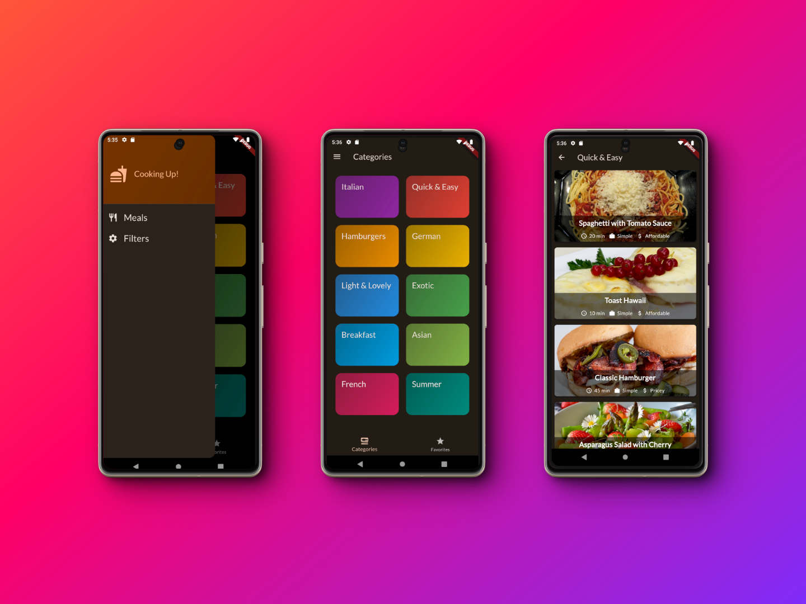

# Flutter Meals App

Welcome to the Meals App, a feature-rich mobile application designed to cater to the diverse culinary preferences and dietary needs of users around the globe. Built with Flutter, this app offers an engaging user experience, showcasing an array of meals from various cuisines. Whether you're looking for your next favorite dish or have specific dietary restrictions, the Meals App provides a tailored browsing experience to suit your needs.

## Overview

The Meals App leverages Flutter to deliver a seamless and interactive user experience, incorporating animations, state management via Riverpod and providers, and robust multi-tab and multi-screen navigation capabilities. Users can discover meals from an extensive selection of cuisines, save their favorite dishes for easy access, and filter options based on dietary restrictions such as lactose intolerance, vegan, vegetarian, and gluten-free diets. This app is your ultimate companion for exploring and enjoying diverse meals tailored to your preferences and needs.

## Key Features

### Diverse Meal Selection
- **Efficient Data Handling:** Uses modern Flutter techniques to fetch a wide variety of meal options from different cuisines. Meals are loaded as you scroll, making the app fast and responsive even on older devices.
Favorites
**Seamless Favorites Management:** With the help of Riverpod and Flutter's built-in storage, the app remembers your favorite meals, keeping them just a tap away, session after session.

### Dietary Filters
**Flexible Meal Filtering:** Whether you're vegan, gluten-free, or have other dietary needs, our app makes it easy to find meals that suit you. Simply select your dietary preferences, and the app will do the rest, instantly updating your meal options.
Engaging Animations
**Smooth User Experience:** The app uses Flutter's animation toolkit to provide a visually engaging experience. From browsing meals to adding favorites, every interaction feels lively and interactive.

### State Management
**Reliable and Responsive:** By leveraging Riverpod, the app efficiently manages its state, ensuring that the user interface is always up to date. Whether it's updating your favorites or applying filters, changes reflect immediately across the app.
Multi-Tab and Multi-Screen Navigation
**Intuitive Navigation:** Explore the app with ease thanks to a well-organized multi-tab layout that allows for smooth switching between different sections. The app also remembers your last visited page, so you can pick up right where you left off.

## Mockups

Dive into the visual design of the Meals App with our detailed mockups. See how the app's design caters to an intuitive and engaging user experience, from browsing meals to filtering your dietary preferences.

## Demo

Experience the Meals App in action. Browse through our demo to get a glimpse of the user-friendly interface, smooth navigation, and how you can interact with different features of the app.

## Credits

This project was inspired by the course ["Learn Flutter & Dart to Build iOS & Android Apps"](https://www.udemy.com/course/learn-flutter-dart-to-build-ios-android-apps/) by Academind by Maximilian Schwarzmüller. The course was instrumental in providing a solid foundation in Flutter app development.

